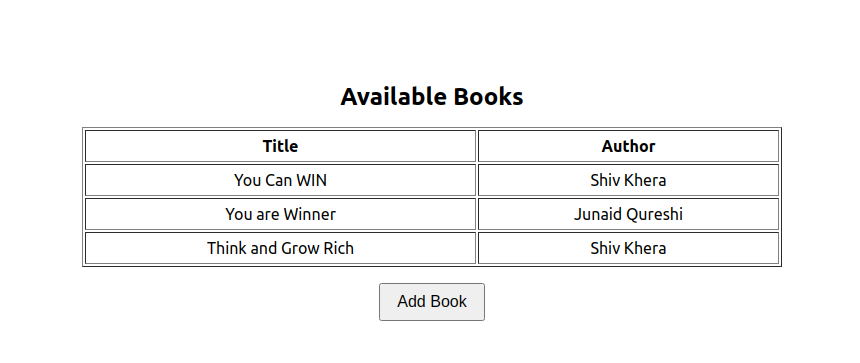

## Mirage Js Tutorial

#### Mirage JS is an API mocking library that lets you build, test and share a complete working JavaScript application without having to rely on any backend services.

### Explained with a "Simple" _Library Management System_ Example using ReactJs

